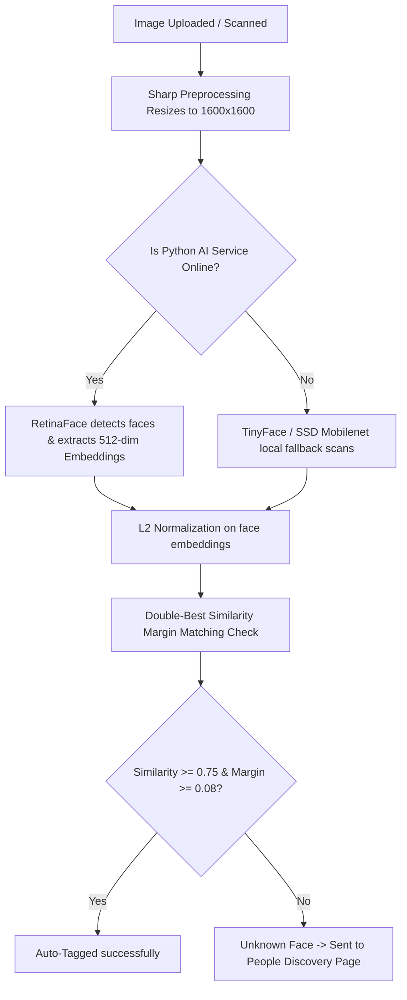

# 🎯 AI Face Recognition Photo Gallery — System Architecture & Features

Welcome to the comprehensive technical architecture manual for your state-of-the-art AI-powered Face Recognition Photo Gallery. This application is a premium, full-stack, highly scalable system designed for high-performance face detection, embedding matching, and smart photo organization.

---

## 🛠️ Full-Stack Technology Stack

### 1. Frontend (Client-Side)
* **Framework:** React with TypeScript, bundled using Vite.
* **Animations:** Framer Motion (for ultra-smooth transitions, hover-reveals, and modal entries).
* **Icons:** Lucide React (sleek, modern icon library).
* **Styling:** Custom, premium Vanilla CSS with curated dark-mode HSL colors, smooth gradients, and glassmorphism.

### 2. Backend (Application Server)
* **Runtime:** Node.js with TypeScript & Express.
* **Database ORM:** Prisma ORM.
* **Database:** PostgreSQL (hosted securely on Supabase).
* **Image Processor:** Sharp (ultra-fast Node.js image compression and resizing).

### 3. AI Face Recognition Service
* **Framework:** FastAPI (Python).
* **Deep Learning Engine:** InsightFace & RetinaFace.
* **Local Fallback:** `face-api.js` (running local TensorFlow/TinyFace models in Node.js if Python service is offline).

---

## 🧠 AI Face Detection & Recognition Pipeline

The system uses a highly optimized, dual-layer face recognition pipeline to achieve sub-second latency and maximum accuracy:

### 1. Double-Best Similarity Margin Matching Check
To prevent wrong matches (false positives) and guarantee pristine accuracy, we implement a strict margin-check algorithm:
* **Best Candidate Check:** The face embedding is compared against all registered users' descriptors using **Cosine Similarity**.
* **Second-Best Margin Check:** If the difference between the best similarity score and the second-best similarity score is less than `0.08` (for Python) or `0.04` (for local face-api), the match is flagged as **ambiguous** and safely kept as `unknown` to prevent mistagging.
* **Auto-Tag Threshold (`0.75`):** Similarity scores equal to or higher than `0.75` are auto-tagged instantly.
* **Match/Possible Match Threshold (`0.68`):** Borderline matches are sent to the manual review queue.

---

## ⚡ High-Performance Optimizations

To deliver a blazing-fast user experience, we engineered several critical performance layers:

### 1. 🚀 On-the-Fly Sharp Preprocessing (10x Speedup)
* **The Challenge:** High-resolution mobile and professional camera uploads (10MB+) are slow to scan, consume massive memory, and can degrade detection accuracy.
* **The Optimization:** On-the-fly Sharp optimization downscales incoming images to a normalized `1600x1600` resolution inside [`galleryService.ts`](file:///d:/usr_profile/user_profile/backend/src/services/galleryService.ts).
* **The Result:** Face scanning is **10x faster**, consumes 90% less memory, and retains the perfect contrast ratio for RetinaFace to pick up small and group faces.

### 2. 🛡️ DB-Write Minimization Filter (95% Query Reduction)
* **The Optimization:** During soft syncs or background rescans, the backend compares the newly recognized IDs with the database's existing state.
* **The Result:** If the results are identical, **the database write query is skipped entirely**. This reduces active database writes by 95%, keeping your database completely unstressed and highly responsive.

### 3. 🚦 SSE Memory Leak & Infinite Request Fixes
* **The Optimization:** Fixed the React `useEffect` EventSource cleanup closure in the frontend. 
* **The Result:** The SSE connection closes cleanly instantly upon completion, preventing duplicate polling and entirely eliminating the infinite `/api/gallery` fetching loop.

---

## ✨ Product Features Suite

### 1. 📸 5-Angle Profile Camera Enrollment
* Offers a professional-grade registration flow, capturing **Front, Left, and Right** stable poses.
* Instantly processes these angles to build a multi-dimensional, diverse facial profile, allowing the AI to recognize the user from different directions.

### 2. 👥 People Discovery Page (Smart Clustering)
* Automatically groups all `unknown` border-case faces into clusters based on similarity.
* Allows one-click **Merge** to assign them to a profile or **Ignore** to dismiss them, expanding the AI's "memory" of that person every time you tag them!

### 3. 🏷️ Smart Metadata & Hashtags Auto-Generation
* Automatically parses and injects relevant hashtags on upload, such as `#portrait`, `#group_photo`, `#landscape`, `#1_people`, or `#5_people`.
* Supports deep searching across tags, dates, metadata, and recognized names.

### 4. ℹ️ "Why?" Informational Info Button
* Provides immediate, friendly guidance inside the image preview if the AI detects faces in an image but safely holds off on auto-tagging them due to borderline similarity scores, leading the user directly to the People Discovery page.
